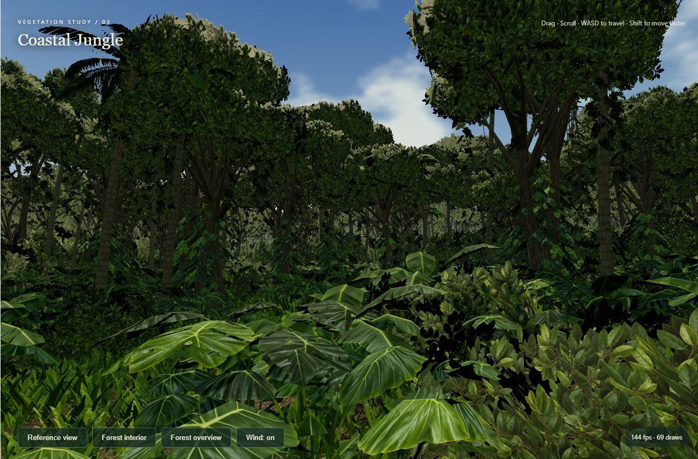
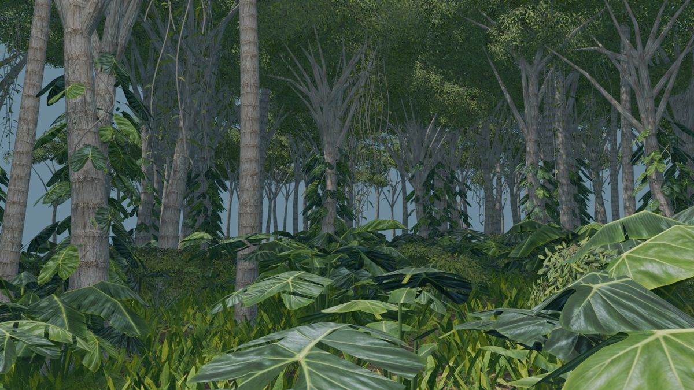
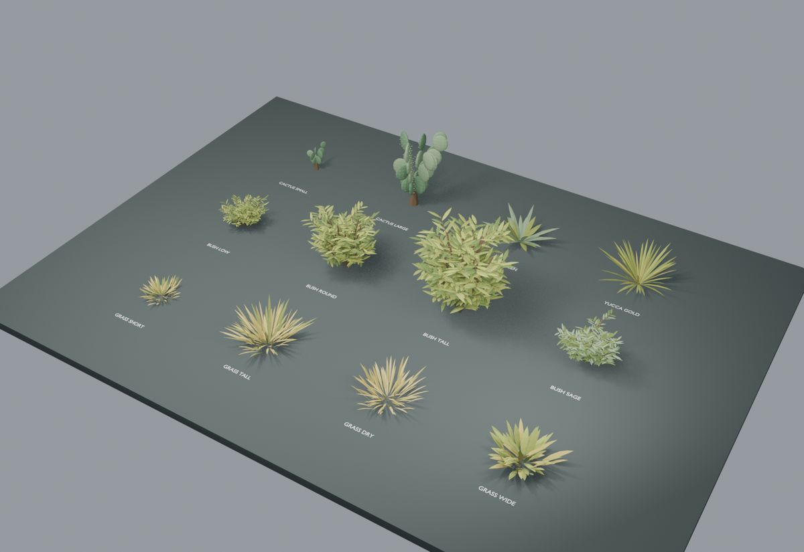
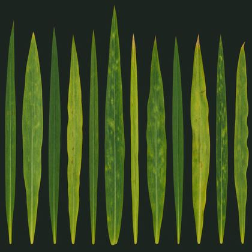
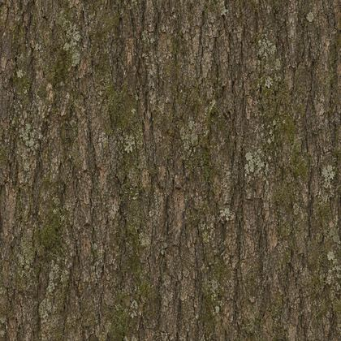
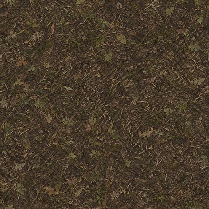

# Codex + Blender

A reproducible, code-first workflow for using GPT-6 Astra / Codex with Blender.

> **Git-controlled configuration and Blender Python are the source of truth. MCP is an interactive inspection layer, not the canonical scene state.**

The repository implements the workflow described by OpenAI's published GPT-6 Astra Blender example: programmatic `bpy` scene work, headless Blender execution, render inspection, structured validation, and iterative correction.

## Architecture

```text
Human brief
    |
    v
GPT-6 Astra / Codex
    |\
    | \---- Blender MCP -------- live inspection / experiments
    |
    +---- YAML + Python -------- durable source
                |
                v
         Blender --background
                |
               bpy
                |
       .blend + renders + state
                |
                v
     structural + image checks
                |
                v
      Astra multi-view review
                |
        pass ---+--- fail
                     |
                     v
               Codex correction
                     |
                     +----> clean rebuild
```

The control hierarchy is:

1. **YAML/JSON** — dimensions, assets, cameras, render settings, acceptance policy.
2. **`bpy` Python** — deterministic construction and scene transformations.
3. **Blender CLI** — clean builds, renders, inspection and structural validation.
4. **Codex + GPT-6 Astra** — structured multi-view visual review and bounded source correction.
5. **Blender MCP** — live summaries, screenshots, navigation and experiments.
6. **GUI/computer use** — exceptional UI-only work.

## Requirements

- Blender available through `BLENDER_BIN` or `PATH` for local runs.
- Python 3.11+ for host-side orchestration.
- Codex CLI 0.153.0+ for GPT-6 Astra in Codex.
- An account/workspace with GPT-6 Astra available for model review.
- `pip install -r requirements.txt`.

The CI reference runtime is declared in `config/toolchain.yaml`; local installations may use another compatible Blender version, but the pinned CI version is the tested baseline.

## Quick start

```bash
pip install -r requirements.txt
python scripts/check_environment.py
python scripts/blender_runner.py all
```

Core outputs:

```text
output/
├── scene.blend
├── render.png
├── renders/
├── render_index.json
├── scene_state.json
├── validation.json
├── visual_evaluation.json
└── _resolved_workflow.json
```

Run deterministic render checks without Astra:

```bash
python scripts/visual_evaluator.py --skip-model
```

Run full GPT-6 Astra review:

```bash
python scripts/visual_evaluator.py
```

Run the bounded autonomous correction loop from a clean Git worktree:

```bash
python scripts/iteration_controller.py
```

Run two independent clean builds and compare the structural manifests:

```bash
python scripts/reproducibility_check.py
```

This produces `output/reproducibility.json` and per-run snapshots under `output/reproducibility/`.

## Coastal jungle

GPT-6 Astra generated this coastal jungle on a ChatGPT Plus account in two rounds: procedural plant meshes, ChatGPT albedo textures, scene composition, and the Three.js viewer. The durable source is still YAML plus Blender Python.

<p align="center">
  
  
</p>

Online demo: https://danielsobrado.github.io/Codex-and-Blender/

Local preview (after `cd web`, `npm ci`, `npm run dev`):

http://127.0.0.1:4173

A separate reusable plant kit covers dry-hillside grass, shrubs, yucca, cactus and sage:

<p align="center">
  
</p>

## Generated textures

Plant meshes are procedural Blender Python. Surface color comes from ChatGPT image generation (12 September 2026): flat orthographic albedo scans, not photos and not calibrated PBR maps. There are no generated normal or roughness maps.

<p align="center">
  
  
  
</p>
<p align="center">
  
  
  
</p>

Grass · tropical leaves · palm/fern · mossy bark · palm bark · forest floor.

See `docs/COASTAL_JUNGLE.md` for the forest kit and `docs/TROPICAL_KIT.md` for the ChatGPT prompts used to request these albedo scans.

## Acceptance and autonomous-loop safety

`config/acceptance.yaml` is authoritative for structural requirements, required render views, and iteration policy. Required camera names/roles live there rather than only in mutable scene configuration, so an autonomous correction cannot improve its score by silently reducing review coverage.

The parent controller snapshots protected files before each correction-worker turn. If the worker changes acceptance/evaluator/autonomy policy, the review schema/prompt, orchestration code, or structural-validator implementation, the controller restores those files and stops the loop.

A live MCP edit is never accepted as completion until its durable equivalent exists in repository source and survives a clean build.

## Optional Blender MCP

The official Blender Lab architecture is:

```text
Codex / MCP client
      |
      | MCP over stdio
      v
  blender-mcp
      |
      | TCP
      v
Blender MCP add-on
      |
      v
     bpy
```

After installing the official server/add-on:

```bash
codex mcp add blender -- blender-mcp
codex mcp list
```

Copy `.codex/config.toml.example` to `.codex/config.toml` for project-local configuration. MCP remains optional: deterministic scene construction, CI and render evaluation do not depend on a live MCP session.


## License

This project is licensed under the [MIT License](LICENSE).
